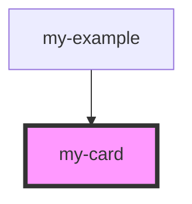

# my-card

<!-- Auto Generated Below -->

## Dependencies

### Used by

 - [my-example](../my-example)

### Graph

----------------------------------------------

*Built with [StencilJS](https://stenciljs.com/)*
